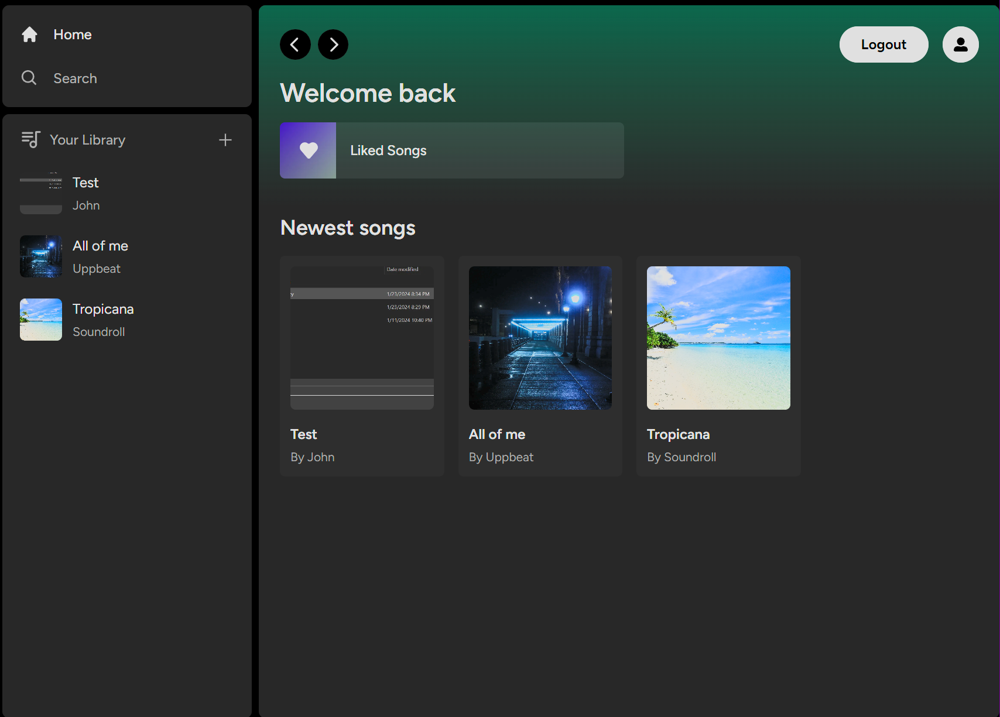
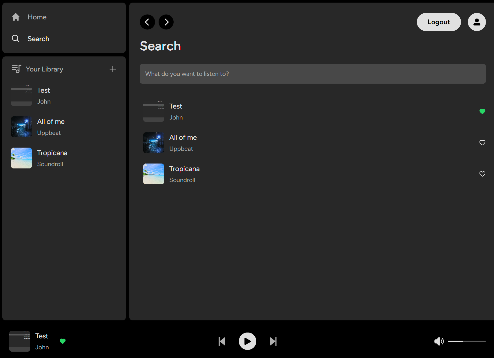
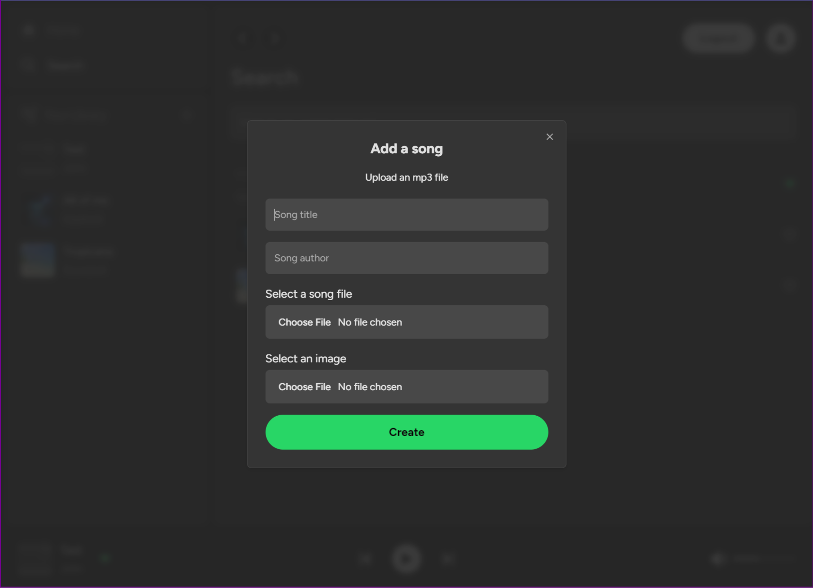

# Spotify Clone

Spotify clone that incorporates some basic functionality like signin / signup, payment handling, playing audio. It also replicates Spotify UI.

Technologies used through the course: **NextJS**, **React**, **Typescript**, **Supabase**, **Stripe**, **TailwindCSS**

## Local Testing

You need to have Stripe running for local testing. Follow the [following steps](https://dashboard.stripe.com/test/webhooks/create?endpoint_location=local):

- Open Powershell and run `stripe login`
- Run `npm run dev`
- Run `stripe listen --forward-to localhost:3000/api/webhooks` in Powershell
- The command above will provide you a webhook secret. You need to insert it to the `.env.local` STRIPE_WEBHOOK_SECRET variable

